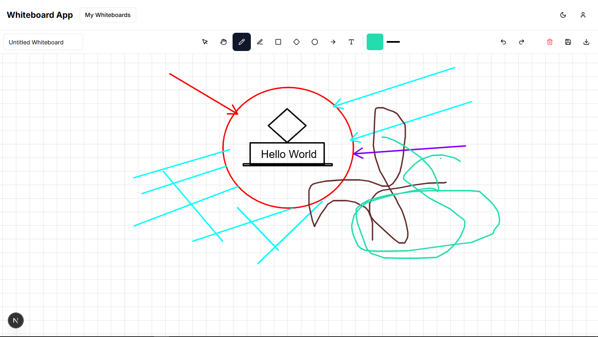

# 🧠 Whiteboard App

A sleek and intuitive **digital whiteboard** app built with Next.js and Tailwind CSS. Perfect for sketching ideas, diagrams, flows, and everything in between—right in your browser.



---

## ✨ Features

- 🖊️ Freehand Drawing with Multiple Colors  
- 🔲 Shapes (Rectangle, Circle, Diamond)  
- ➡️ Arrow Drawing & Connectors  
- 📝 Text Tool  
- ♻️ Undo/Redo Support  
- 🎨 Color Palette Tool  
- 💾 Save and Export Whiteboard  
- 🔁 Grid Background with Snapping  

---

## 🚀 Getting Started

### 1. Clone the Repository

```bash
git clone https://github.com/hariop12/whiteboard.git
cd whiteboard
```

### 2. Install Dependencies

```bash
npm install
```

> If you encounter peer dependency issues, try with:  
> `npm install --legacy-peer-deps`

### 3. Configure Environment Variables

1. Rename the `sample.env` file to `.env`  
2. Fill in the following environment variables:

```
NEXTAUTH_SECRET=your_generated_nextauth_secret
MONGODB_URI=your_mongodb_connection_string
```

#### 🔐 Generating a NEXTAUTH_SECRET

You can generate a secure secret using node with crypto:

```bash
node -e "console.log(require('crypto').randomBytes(32).toString('hex'))"
```

Paste the output as your `NEXTAUTH_SECRET`.

---

### 4. Start the Dev Server

```bash
npm run dev
```

Then open [http://localhost:3000](http://localhost:3000) in your browser.

---

## 🛠️ Tech Stack

- **Framework**: Next.js (App Router)  
- **Language**: TypeScript  
- **Styling**: Tailwind CSS + PostCSS  
- **State Management**: React + Custom Contexts  
- **Canvas Logic**: Custom hooks and drawing logic  

---

## 🗂 Folder Structure

```
whiteboard/
│
├── app/                 # Next.js App Router pages & layout
├── components/          # Reusable UI components (Toolbars, Buttons, etc.)
├── contexts/            # React Contexts (Drawing, Theme, etc.)
├── hooks/               # Custom hooks (drawing, shape logic, etc.)
├── lib/                 # Utility functions and helpers
├── types/               # TypeScript types
├── public/              # Static assets
├── styles/              # Global styles and Tailwind base
│
├── .env                 # Environment variables
├── tailwind.config.ts   # Tailwind config
├── postcss.config.mjs   # PostCSS config
├── next.config.mjs      # Next.js config
├── package.json
├── tsconfig.json
├── package-lock.json
```

---

## 🔮 Roadmap

- [ ] 🎯 Real-time Multiplayer Collaboration  
- [ ] 👥 Authentication & Persistent Boards  
- [ ] 📊 Whiteboard Templates (Mindmap, Flowchart, etc.)  
- [ ] 🕒 Version Control & History Playback  
- [ ] 📥 Import/Export Boards as JSON  

---

## 💬 Contributing

Currently a solo project, but contributions are welcome in the future! Feel free to fork the repo and explore 💙

---

## 📃 License

This project is licensed under the [MIT License](./LICENSE)

---

## 🙋 Author

Made with ☕ and ☁️ by [Harish](https://github.com/hariop12/)